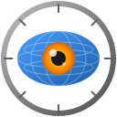
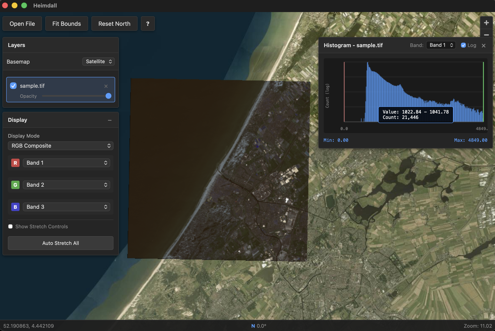

# Heimdall

<p align="center">
  
</p>

A lightweight, fast geospatial raster and vector viewer built with Tauri, Rust, and MapLibre GL. Designed as a modern replacement for OpenEV.

## Why "Heimdall"?

In Norse mythology, **Heimdall** is the watchman of the gods. Standing at the edge of Bifrost, the rainbow bridge, he possesses extraordinary sight - able to see for hundreds of miles across all the nine realms, by day or night. He requires less sleep than a bird and can hear grass growing on the earth.

Just as Heimdall watches over the realms, this application lets you observe and explore your geospatial data - from satellite imagery spanning continents to the finest details of vector features.

<p align="center">
  
</p>

## Features

- **Fast raster viewing** - GDAL-powered tile extraction with automatic reprojection
- **Vector support** - Load shapefiles, GeoJSON, GeoPackage, KML, and more
- **Multi-layer support** - Load multiple files, drag to reorder
- **Dynamic adjustment** - Real-time min/max/gamma controls per band
- **RGB compositing** - Combine bands from single or multiple files
- **Vector styling** - Color by field, adjust fill/stroke, view attribute table
- **Basemaps** - OpenStreetMap, Sentinel-2 Cloudless satellite imagery, custom tile URLs, or none
- **3D Terrain** - Visualize elevation with adjustable exaggeration
- **Non-georeferenced images** - View regular images with pixel coordinates and grid overlay
- **Distance measurement** - Measure distances in meters/km (geographic) or pixels (non-geo images)
- **STAC Browser** - Search and load satellite imagery from STAC APIs (Sentinel-2, Landsat, etc.)
- **Keyboard-driven** - Full keyboard shortcuts for power users

## Keyboard Shortcuts

### File Operations
| Key | Action |
|-----|--------|
| `Ctrl+O` | Open file(s) |
| `Ctrl+S` | Save project |
| `Ctrl+Shift+O` | Load project |
| `E` | Export as PNG |
| `Ctrl+Shift+E` | Export high-res (2x) |
| `Ctrl+Shift+C` | Copy to clipboard |

### Tools
| Key | Action |
|-----|--------|
| `Z` | Zoom rectangle - draw a box to zoom into |
| `M` | Measure distance |
| `I` | Inspect pixel values |
| `P` | Elevation profile |
| `A` | Annotate (marker mode) |
| `C` | Open STAC Browser |
| `Enter` | Generate profile (when in profile mode) |

### View Controls
| Key | Action |
|-----|--------|
| `F` | Fit to extent |
| `R` | Reset rotation |
| `B` | Cycle basemap (OSM → Satellite → Pixel Grid → None) |
| `T` | Toggle 3D terrain |
| `Ctrl+Drag` | Rotate map |
| `Right-Drag` | Pitch/tilt (3D mode) |
| `Scroll` | Zoom in/out |

### Layer Management
| Key | Action |
|-----|--------|
| `L` | Toggle layer panel |
| `D` | Toggle display panel |
| `V` | Toggle selected layer visibility |
| `Shift+A` | Open attribute table (vector layers) |
| `H` | Show histogram (raster layers) |
| `Del` | Remove selected layer |

### General
| Key | Action |
|-----|--------|
| `Esc` | Close panels / cancel tool |
| `?` | Show keyboard shortcuts |

## Supported Formats

### Raster Formats
Any raster format supported by GDAL, including:
- GeoTIFF (.tif, .tiff)
- JPEG2000 (.jp2, .j2k)
- PNG, JPEG, GIF, BMP
- ERDAS Imagine (.img)
- ENVI (.hdr, .bil, .bsq)
- NetCDF (.nc)
- HDF5 (.h5, .hdf)
- VRT (.vrt)
- And many more...

### Vector Formats
- Shapefile (.shp)
- GeoJSON (.geojson, .json)
- GeoPackage (.gpkg)
- KML/KMZ (.kml, .kmz)
- GML (.gml)
- GPX (.gpx)
- FlatGeobuf (.fgb)
- MapInfo TAB (.tab, .mif)

## Installation

### Prerequisites

- **Rust** (1.70+): https://rustup.rs/
- **Node.js** (18+): https://nodejs.org/
- **GDAL** (3.0+):
  - macOS: `brew install gdal`
  - Ubuntu: `sudo apt install libgdal-dev`
  - Windows: OSGeo4W or GISInternals

### Build from Source

```bash
# Clone the repository
git clone https://github.com/tapiab/heimdall.git
cd heimdall

# Install dependencies
npm install

# Run in development mode
npm run tauri dev

# Build for production
npm run tauri build
```

The production build outputs are located in `src-tauri/target/release/bundle/`:
- **macOS**: `.dmg` and `.app`
- **Windows**: `.msi` and `.exe`
- **Linux**: `.deb`, `.rpm`, and `.AppImage`

## Testing

The project includes comprehensive unit tests for both the Rust backend and JavaScript frontend.

### Running All Tests

```bash
# Run JavaScript tests
npm run test:run

# Run Rust tests
cd src-tauri && cargo test

# Run both
npm run test:run && cd src-tauri && cargo test
```

### JavaScript Tests (Vitest)

```bash
# Run tests once
npm run test:run

# Run tests in watch mode (for development)
npm run test

# Run tests with coverage
npm run test:coverage
```

Tests are located in `src/lib/__tests__/` and cover:
- Geospatial utility functions (bounds extraction, intersection)
- Color expression builders (categorical and graduated)
- File path utilities and format detection
- Distance measurement (Haversine geodesic and pixel Euclidean)
- Pixel grid basemap (grid spacing calculation, coordinate conversion)
- Terrain functionality (enable/disable, exaggeration)

### Rust Tests

```bash
cd src-tauri

# Run all tests
cargo test

# Run tests with output
cargo test -- --nocapture

# Run specific test
cargo test test_bounds_intersect
```

Tests are located in `src-tauri/src/` and cover:
- **Tile extraction** (`gdal/tile_extractor.rs`): Coordinate conversion, bounds intersection, stretch calculations
- **STAC API** (`commands/stac.rs`): Data structure serialization/deserialization, URL construction, extent parsing, asset handling, error cases

```bash
# Run STAC-specific tests
cargo test stac

# Run integration test with real COG (requires network)
cargo test test_vsicurl_real_cog -- --ignored
```

### Code Quality Checks

```bash
# JavaScript linting (if configured)
npm run lint

# Rust checks
cd src-tauri
cargo check      # Type checking
cargo clippy     # Linting
cargo fmt --check # Formatting
```

## Usage

1. **Open files**: Click "Open" or press `Ctrl+O`
2. **Navigate**: Pan with mouse drag, zoom with scroll wheel
3. **Adjust display**: Use the controls panel to adjust min/max/gamma
4. **RGB composite**: Select "RGB Composite" or "Cross-Layer RGB" mode
5. **Layer management**: Toggle visibility, adjust opacity, reorder by dragging

## Basemaps

Heimdall provides several basemap options:

| Basemap | Description |
|---------|-------------|
| **OSM** | OpenStreetMap - street map with roads, buildings, labels |
| **Satellite** | Sentinel-2 Cloudless (CC BY 4.0) - global 10m resolution imagery |
| **Custom** | User-configured tile URL (e.g., Mapbox, your own tile server) |
| **Pixel Grid** | For non-georeferenced images - shows pixel coordinates |
| **None** | Transparent background |

### Custom Basemap Configuration

To configure a custom basemap (e.g., Mapbox Satellite, your own tile server):

1. Click the ⚙ gear icon next to the basemap dropdown
2. Enter a tile URL template with `{z}`, `{x}`, `{y}` placeholders
3. Optionally add attribution text
4. Click "Save"

Example URLs:
- Mapbox: `https://api.mapbox.com/v4/mapbox.satellite/{z}/{x}/{y}.png?access_token=YOUR_TOKEN`
- Custom TMS: `https://your-server.com/tiles/{z}/{x}/{y}.png`

Custom basemap settings are stored in a config file and persist across sessions.

## STAC Browser

Heimdall includes a built-in STAC (SpatioTemporal Asset Catalog) browser for searching and loading satellite imagery directly from cloud archives.

### Supported STAC APIs

- **Earth Search** (AWS): `https://earth-search.aws.element84.com/v1` - Sentinel-2, Landsat, NAIP, and more
- **Microsoft Planetary Computer**: `https://planetarycomputer.microsoft.com/api/stac/v1`
- **Any STAC API** compliant with the STAC 1.0.0 specification

### Using the STAC Browser

1. **Open STAC Browser**: Press `C` or click the "STAC" button in the toolbar
2. **Select API**: Choose from preset APIs (Earth Search, Planetary Computer) or select "Custom URL..." to enter your own
3. **Connect**: Click "Connect" to connect to the selected API
4. **Select Collection**: Choose a collection (e.g., `sentinel-2-l2a`)
5. **Set Search Filters**:
   - Click "Use Current View" to search within the visible map area, or "Draw Area" to draw a bounding box
   - Set date range for temporal filtering
   - Adjust cloud cover threshold (for optical imagery)
6. **Search**: Click "Search" to find matching scenes
7. **View Results**: Scene footprints appear on the map; click to select
8. **Load Asset**: Select an asset (e.g., `visual` for true color, individual bands) and click "Load"

### Asset Types

| Asset | Description |
|-------|-------------|
| `visual` / `TCI` | True Color Image (RGB composite, 8-bit) |
| `B02`, `B03`, `B04` | Individual spectral bands (Blue, Green, Red) |
| `B08` | Near-Infrared band |
| `SCL` | Scene Classification Layer |

### Performance Features

- **Cloud Optimized GeoTIFF (COG)**: Streams tiles directly from cloud storage
- **Overview-based loading**: Automatically selects appropriate resolution for current zoom level
- **HTTP/2 multiplexing**: Efficient parallel range requests for fast tile loading

### Tips

- **Toggle footprints**: Click "Hide"/"Show" in results header to toggle scene outline visibility
- **Auto-hide footprints**: Footprints are automatically hidden when closing the STAC panel (restored when reopened)
- **Clear results**: Click "Clear" to remove all footprints and reset the search
- **Multiple assets**: Load multiple assets from different scenes as separate layers
- **Switching APIs**: Changing the selected API automatically clears previous results and collections

## CI/CD

The project includes GitLab CI configuration (`.gitlab-ci.yml`) for automated testing and multi-platform builds.

### Pipeline Stages

1. **Check**: Linting and formatting (JS tests, Rust clippy/fmt)
2. **Test**: Unit tests (JS via Vitest, Rust via cargo test)
3. **Build**: Multi-platform builds (Linux, macOS, Windows)

### Supported Build Targets

| Platform | Architecture | Artifacts |
|----------|--------------|-----------|
| Linux | x86_64 | `.deb`, `.rpm`, `.AppImage` |
| Linux | ARM64 | `.deb`, `.AppImage` |
| macOS | x86_64 | `.dmg`, `.app` |
| macOS | ARM64 (Apple Silicon) | `.dmg`, `.app` |
| Windows | x86_64 | `.msi`, `.exe` |
| Windows | ARM64 | `.msi`, `.exe` |

### Running Builds Locally

```bash
# Build for current platform
npm run tauri:build

# Build for specific target (macOS example)
npm run tauri:build -- --target aarch64-apple-darwin
npm run tauri:build -- --target x86_64-apple-darwin
```

## Architecture

See [docs/ARCHITECTURE.md](docs/ARCHITECTURE.md) for technical details.

## Tech Stack

- **Frontend**: Vanilla JavaScript + MapLibre GL JS
- **Backend**: Rust + GDAL
- **Framework**: Tauri 2.0
- **Rendering**: WebGL via MapLibre

## License

Apache 2.0

## Acknowledgments

Inspired by OpenEV, the lightweight geospatial viewer that set the standard for fast raster viewing.
