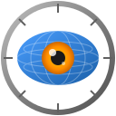
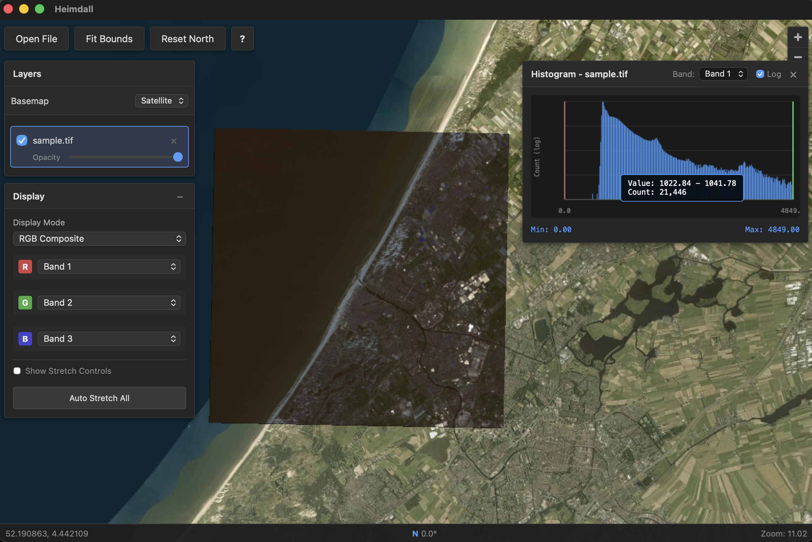

# Heimdall

<p align="center">
  
</p>

A lightweight, fast geospatial raster and vector viewer built with Tauri, Rust, and MapLibre GL. Designed as a modern replacement for OpenEV.

## Why "Heimdall"?

In Norse mythology, **Heimdall** is the watchman of the gods. Standing at the edge of Bifrost, the rainbow bridge, he possesses extraordinary sight - able to see for hundreds of miles across all the nine realms, by day or night.

Just as Heimdall watches over the realms, this application lets you observe and explore your geospatial data - from satellite imagery spanning continents to the finest details of vector features.

<p align="center">
  
</p>

## Features

- **Fast raster viewing** - GDAL-powered tile extraction with automatic reprojection
- **Vector support** - Load shapefiles, GeoJSON, GeoPackage, KML, and more
- **Multi-layer support** - Load multiple files, drag to reorder
- **Dynamic adjustment** - Real-time min/max/gamma controls per band
- **RGB compositing** - Combine bands from single or multiple files
- **Vector styling** - Color by field, adjust fill/stroke, view attribute table
- **Basemaps** - OpenStreetMap, Sentinel-2 satellite imagery, custom tile URLs
- **3D Terrain** - Visualize elevation with adjustable exaggeration
- **Non-georeferenced images** - View regular images with pixel coordinates and grid overlay
- **Manual georeferencing** - Add GCPs to georeference non-geo images (polynomial transforms)
- **Measurement tools** - Distance, pixel inspection, elevation profiles
- **STAC Browser** - Search and load satellite imagery from STAC APIs
- **Annotations** - Add markers and labels to the map
- **Keyboard-driven** - Full keyboard shortcuts for power users

## Installation

### Pre-built Packages (Recommended)

Download the latest release for your platform from the [GitHub Releases](https://github.com/tapiab/heimdall/releases) page:

| Platform | Format |
|----------|--------|
| macOS | `.dmg` |
| Windows | `.msi`, `.exe` |
| Linux | `.deb`, `.rpm`, `.AppImage` |

### Building from Source

See [docs/BUILDING.md](docs/BUILDING.md) for detailed build instructions.

Quick start:
```bash
git clone https://github.com/tapiab/heimdall.git
cd heimdall
npm install
make dev
```

## Keyboard Shortcuts

### File Operations
| Key | Action |
|-----|--------|
| `Ctrl+O` | Open file(s) |
| `Ctrl+S` | Save project |
| `Ctrl+Shift+O` | Load project |
| `E` | Export as PNG |

### Tools
| Key | Action |
|-----|--------|
| `Z` | Zoom rectangle |
| `M` | Measure distance |
| `I` | Inspect pixel values |
| `P` | Elevation profile |
| `A` | Annotate (markers) |
| `G` | Georeference tool |
| `C` | Open STAC Browser |

### View Controls
| Key | Action |
|-----|--------|
| `F` | Fit to extent |
| `R` | Reset rotation |
| `B` | Cycle basemap |
| `T` | Toggle 3D terrain |
| `L` | Toggle layer panel |
| `D` | Toggle display panel |
| `H` | Show histogram |

Press `?` for complete keyboard shortcuts reference.

## Supported Formats

### Raster
Any format supported by GDAL: GeoTIFF, JPEG2000, PNG, JPEG, ERDAS Imagine, ENVI, NetCDF, HDF5, VRT, and more.

### Vector
Shapefile, GeoJSON, GeoPackage, KML/KMZ, GML, GPX, FlatGeobuf, MapInfo TAB.

## STAC Browser

Search and load satellite imagery from cloud archives:

1. Press `C` to open STAC Browser
2. Connect to Earth Search (AWS), Planetary Computer, or custom STAC API
3. Select collection and set filters (area, date, cloud cover)
4. Click scene footprints to select, then load assets

Supports Cloud Optimized GeoTIFFs (COG) with efficient streaming.

## Manual Georeferencing

Georeference non-georeferenced images using Ground Control Points:

1. Load a non-georeferenced image
2. Press `G` to open the Georeference tool
3. Add GCPs by clicking on the image and corresponding map locations
4. Select transformation type (Polynomial 1-3, Thin Plate Spline)
5. Calculate to see RMS error, then apply to create georeferenced output

## Basemaps

| Basemap | Description |
|---------|-------------|
| **OSM** | OpenStreetMap |
| **Satellite** | Sentinel-2 Cloudless (10m resolution) |
| **Custom** | User-configured tile URL |
| **Pixel Grid** | For non-georeferenced images |
| **None** | Transparent background |

Configure custom basemaps via the gear icon next to the basemap dropdown.

## Documentation

- [Building from Source](docs/BUILDING.md)
- [Testing](docs/TESTING.md)
- [Architecture](docs/ARCHITECTURE.md)

## Tech Stack

- **Frontend**: TypeScript + MapLibre GL JS
- **Backend**: Rust + GDAL
- **Framework**: Tauri 2.0
- **Rendering**: WebGL via MapLibre

## License

Apache 2.0

## Acknowledgments

Inspired by OpenEV, the lightweight geospatial viewer that set the standard for fast raster viewing.
